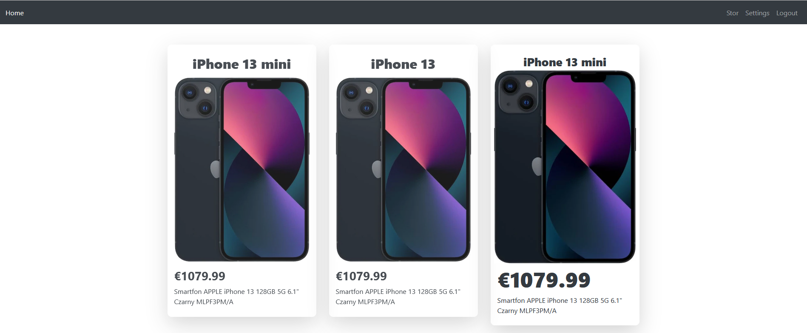

<h1>Store</h1>

**[PHP 7.4](https://www.php.net/releases/7_4_0.php)** 

### Libraries

**[PHP MySQLi Database](https://github.com/ThingEngineer/PHP-MySQLi-Database-Class)** 

**[PHP CURL Class Release 8.5.0](https://github.com/php-curl-class/php-curl-class)** 

**[PayPal-PHP-SDK Release 1.14.0](https://github.com/paypal/PayPal-PHP-SDK)** 

**[PayPal-PHP-SDK notifications (ValidateWebhookEvent)](http://paypal.github.io/PayPal-PHP-SDK/sample/#notifications)** 

 

